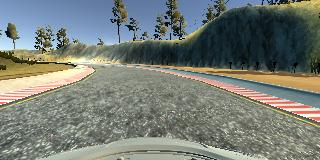
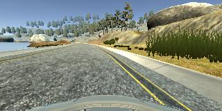
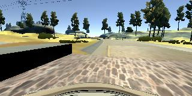
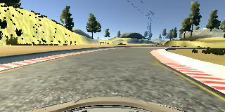
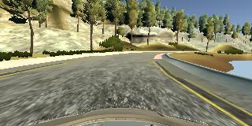
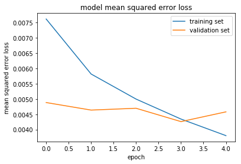

# **Behavioral Cloning** 
---

**Behavioral Cloning Project**

The goals / steps of this project are the following:
* Use the simulator to collect data of good driving behavior
* Build, a convolution neural network in Keras that predicts steering angles from images
* Train and validate the model with a training and validation set
* Test that the model successfully drives around track one without leaving the road
* Summarize the results with a written report

---
### Files Submitted & Code Quality

#### 1. Submission includes all required files and can be used to run the simulator in autonomous mode

My project includes the following files:
* model.py containing the script to create and train the model
* model.html containing the training process and the result of the model 
* drive.py for driving the car in autonomous mode
* model.h5 containing a trained convolution neural network 
* writeup_report.md summarizing the results
* video.mp4  is a video recording of my vehicle driving autonomously one lap around the track

#### 2. Submission includes functional code
Using the Udacity provided simulator and my drive.py file, the car can be driven autonomously around the track by executing 
```sh
python drive.py model.h5
```

#### 3. Submission code is usable and readable

The model.py file contains the code for training and saving the convolution neural network. The file shows the pipeline I used for training and validating the model, and it contains comments to explain how the code works.

#### 4. Submission video is well
I recoded my vehicle driving autonomously around the track. And I changed the speed of the vehicle.The speed is 20 m/s and the tracking result is well.

### Model Architecture and Training Strategy

#### 1. An appropriate model architecture has been employed

The data is normalized and mean centered in the model using a Keras lambda layer (code line 54). 

Each image data is cropped in the model using a Keras Cropping2D layer (code line 56).  

My model consists of 3 convolution neural network with 5x5 filter sizes and 2 convolution neural network with 3x3 filter sizes. And the model includes RELU layers to introduce nonlinearity (code line 58~64).

The model includes 4 fully connected layers. And depth of the last layer is 1.(code line 67-72) 
#### 2. Attempts to reduce overfitting in the model

The model contains 3 dropout layers in order to reduce overfitting (model.py lines 61,63,68,70). 

The model was trained and validated on different data sets to ensure that the model was not overfitting (code line 17). The model was tested by running it through the simulator and ensuring that the vehicle could stay on the track.

#### 3. Model parameter tuning

The model used an adam optimizer, so the learning rate was not tuned manually (model.py line 75).

#### 4. Appropriate training data

Training data was chosen to keep the vehicle driving on the road. I used a combination of center lane driving, recovering from the left and right sides of the road ... 

For details about how I created the training data, see the next section. 

### Model Architecture and Training Strategy

#### 1. Solution Design Approach

The overall strategy for deriving a model architecture was to predict the best angle. So the model is a regression network. 

Finially I used an architecture published by the autonomous vehicle team at NVIDIA. I thought this model might be appropriate because it is similar to this project. It is a regression network and the output is just one value which is the steer angle.

I used the model architecture, the details can see the architecture table in the last section.  

In order to gauge how well the model was working, I split my image and steering angle data into a training and validation set. (model.py line 17)

I found that my first model had a low mean squared error on the training set but a high mean squared error on the validation set. And the validation data loss is not decreasing. This implied that the model was overfitting. 

To combat the overfitting, I modified the model. First I just add two drop layers between fully connneted layers (model.py line 68 and 70). The the validation data loss is improving. But I think the result is not good enough.  

Then I add another two drop layers(model.py line 68 and 70). 

The final step was to run the simulator to see how well the car was driving around track one. First there was just one spot where the vehicle would fall off the track. To improve the driving behavior in these cases, I used the mouse to control the car tracking the center of the road and keep the car running in low speed. 

At the end of the process, the vehicle is able to drive autonomously around the track without leaving the road. But when I turn the car around by Manually. Theres was also just one spot where the vehicle would fall off the track. To improve the driving behavior in these cases, I record counter-clockwise laps around the track. 

At last,the vehicle is able to drive autonomously around the track without leaving the road no matter tracking direction.

#### 2. Final Model Architecture

The final model architecture (model.py lines 54-72) consisted of a convolution neural network with the following layers and layer sizes.

| Layer         		|     Description	        					| 
|:---------------------:|:---------------------------------------------:| 
| Input         		| 160x320x3 RGB image   						| 
| Lambda            	| x/255.0 - 0.5 normalized and mean_centered 	|
| Cropping2D		    | cropping=((70,25),(0,0))						|
| Convolution	      	| 5x5 stride,2x2 subsample                  	|
| RELU					|												|
| Convolution   	    | 5x5 stride,2x2 subsample                      |
| RELU					|												|
| Convolution       	| 5x5 stride,2x2 subsample                  	|
| RELU					|												|
| Dropout   	      	| 0.5                           				|
| Convolution    	    | 3x3 stride                                    |
| RELU					|												|
| Dropout   	      	| 0.5                           				|
| Convolution    	    | 3x3 stride                                    |
| RELU					|												|
| Fully connected		| outputs 100  									|
| Dropout				| 0.5 											|
| Fully connected		| outputs 50  									|
| Dropout				| 0.5 											|
| Fully connected		| outputs 10  									|
| Fully connected		| outputs 1  									|

#### 3. Creation of the Training Set & Training Process

To capture good driving behavior, I first recorded one laps on track one using center lane driving. Here is an example image of center lane driving:



I then recorded the vehicle recovering from the left side and right sides of the road back to center so that the vehicle would learn to how to recover from the side of the road. These images show what a recovery looks like starting from left, right, left:




I repeated this process on track two in order to get more data points. 

To augment the data set and make the training generalization better. I also turn the car around and record counter-clockwise laps around the track. Here is an image from recording counter-clockwise laps





After the collection process, I had 4853 number of data points. I then preprocessed this data by normalized and mean_centered. And I cropped each image to focus on only the portion of the image that is useful for predicting a steering angle. I think the sky and the car is not useful. The model trains faster and better after preprocessing.

I finally randomly shuffled the data set and put 20% of the data into a validation set. 

I used this training data for training the model. The validation set helped determine if the model was over or under fitting. 

The ideal number of epochs was 5 as evidenced by the follow plot.



I used an adam optimizer so that manually training the learning rate wasn't necessary.
